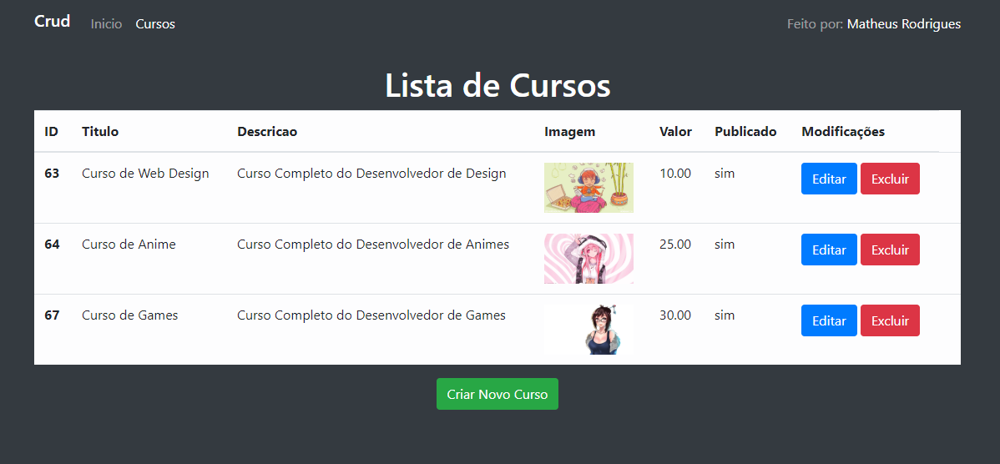
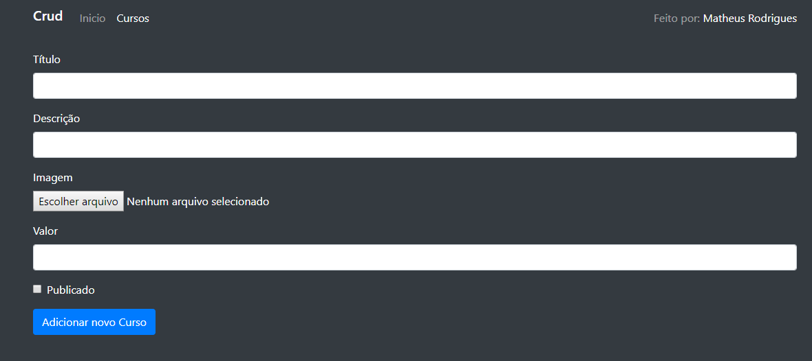

# CRUD 
Crud feito para por em prática os elementos do framework laravel.
Utilizei Bootstrap 4 como design responsivo para o layout das páginas.

## Layout Principal

## Tabela de listagem

## Formulário de criação

## Formulário de edição

## Laravel
Documentação do Laravel pode ser acha em: [Laravel website](http://laravel.com/docs).
